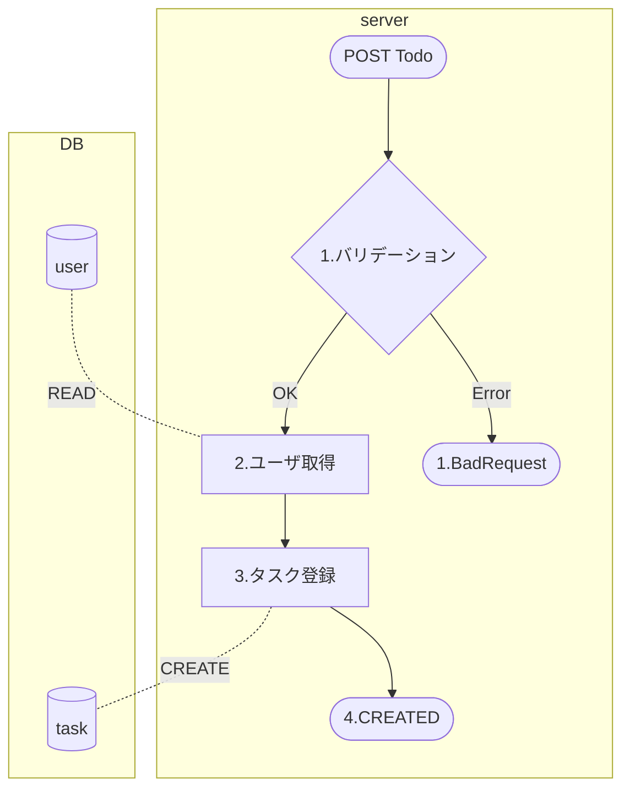

# 処理フロー

## フロー図

## 処理詳細

1. バリデーション
   ErrorCheck 参照
   エラー判定の場合、400-BadRequest を返却

| 位置 | 論理名             | 物理名             | 設定値                         | 備考 |
| ---- | ------------------ | ------------------ | ------------------------------ | ---- |
| 1    | エラーコード       | errorCode          | BAD_REQUEST                    |      |
| 1    | エラー内容         | ServerErrorContent |                                |      |
| 2    | エラー名           | name               | API_ERROR                      |      |
| 2    | HTTP ステータス    | status             | 400                            |      |
| 2    | ステータステキスト | statusText         | Bad Request                    |      |
| 2    | エラーメッセージ   | message            | [{エラーに対応するメッセージ}] |      |

2. ユーザ取得
   セッションからユーザ情報の取得

- READ：user テーブル

  - 抽出項目

  | 論理名    | 物理名  | 備考 |
  | --------- | ------- | ---- |
  | ユーザ ID | user_id |      |

  - 条件

  | 論理名 | 物理名 | 条件     |
  | ------ | ------ | -------- |
  | sub    | sub    | 完全一致 |

3. タスク登録
   リクエスト内容で task テーブルに登録

4. レスポンス生成

| 位置 | 論理名    | 物理名    | 型     | 設定値          | 備考 |
| ---- | --------- | --------- | ------ | --------------- | ---- |
| 1    | タスク ID | taskId    | long   | DB 登録の戻り値 |      |
| 1    | タスク名  | name      | string | DB 登録の戻り値 |      |
| 1    | 開始日    | startDate | date   | DB 登録の戻り値 |      |
| 1    | タスク ID | endDate   | date   | DB 登録の戻り値 |      |
| 1    | 優先度    | priority  | int    | DB 登録の戻り値 |      |
| 1    | 備考      | note      | string | DB 登録の戻り値 |      |
