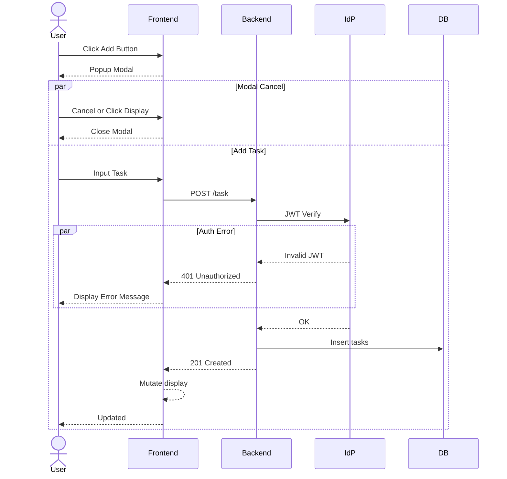
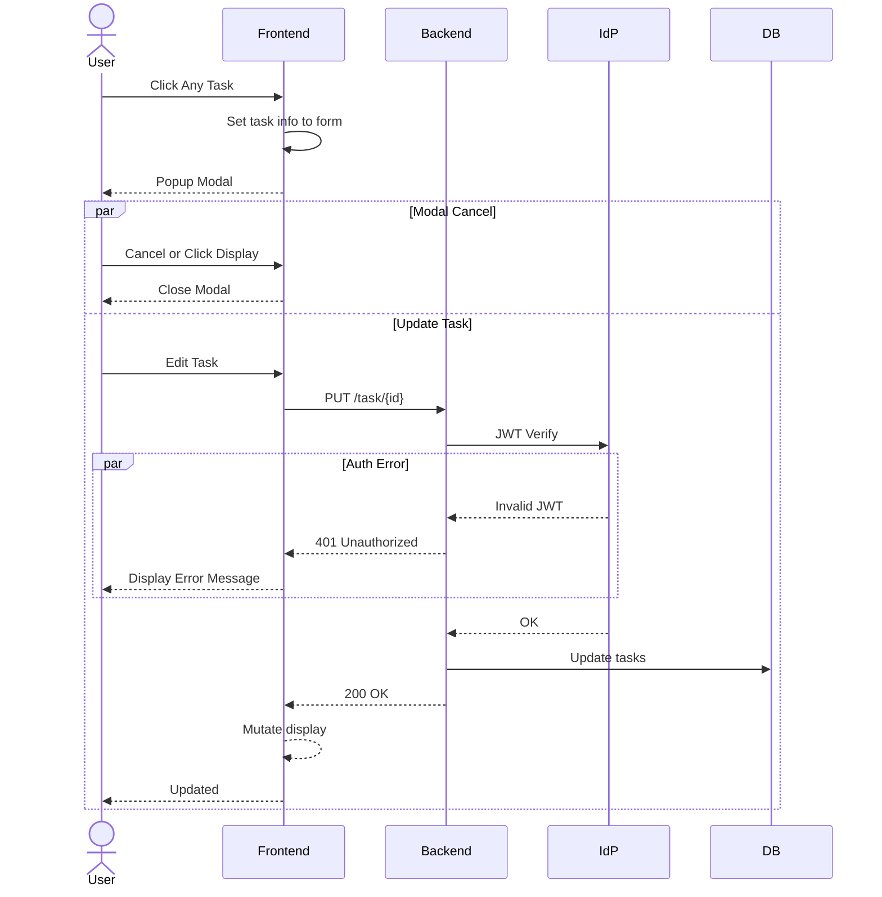

## シーケンス

※その画面で実行する API の全シーケンスを記載する

### タスク追加

```mermaid
sequenceDiagram
    actor User
    participant Frontend
    participant Backend
    participant IdP
    participant DB

    User->>Frontend: Click Add Button
    Frontend-->>User: Popup Modal
    par Modal Cancel
        User->>Frontend: Cancel or Click Display
        Frontend-->>User: Close Modal
    and Add Task
        User->>Frontend: Input Task
        Frontend->>Backend: POST /task
        Backend->>IdP: JWT Verify
        par Auth Error
            IdP-->>Backend: Invalid JWT
            Backend-->>Frontend: 401 Unauthorized
            Frontend-->>User: Display Error Message
        end
        IdP-->>Backend: OK
        Backend->>DB: Insert tasks
        Backend-->>Frontend: 201 Created
        Frontend-->>Frontend: Mutate display
        Frontend-->>User: Updated
    end
```

### タスク更新

```mermaid
sequenceDiagram
    actor User
    participant Frontend
    participant Backend
    participant IdP
    participant DB

    User->>Frontend: Click Any Task
    Frontend->>Frontend: Set task info to form
    Frontend-->>User: Popup Modal
    par Modal Cancel
        User->>Frontend: Cancel or Click Display
        Frontend-->>User: Close Modal
    and Update Task
        User->>Frontend: Edit Task
        Frontend->>Backend: PUT /task/{id}
        Backend->>IdP: JWT Verify
        par Auth Error
            IdP-->>Backend: Invalid JWT
            Backend-->>Frontend: 401 Unauthorized
            Frontend-->>User: Display Error Message
        end
        IdP-->>Backend: OK
        Backend->>DB: Update tasks
        Backend-->>Frontend: 200 OK
        Frontend-->>Frontend: Mutate display
        Frontend-->>User: Updated
    end
```
